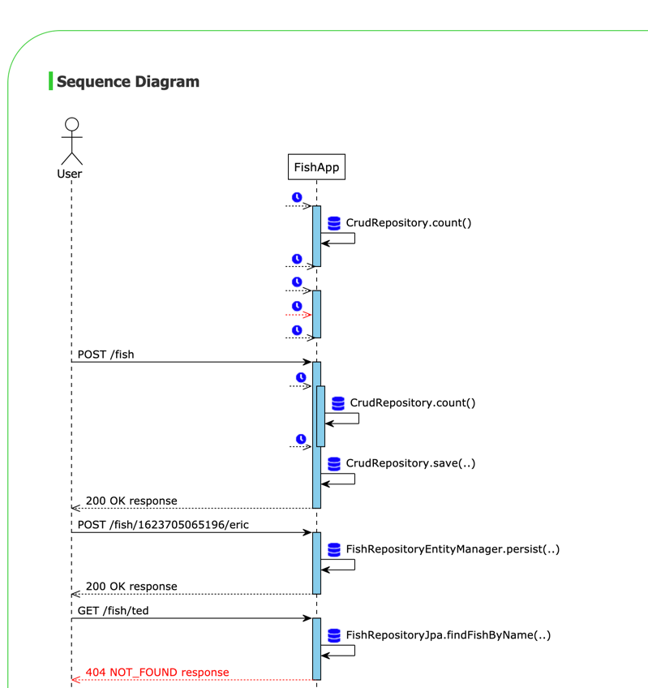

[](https://github.com/semantic-release/semantic-release)

# lsd-interceptors 
[](https://github.com/lsd-consulting/lsd-interceptors/actions/workflows/ci.yml)
[](https://github.com/lsd-consulting/lsd-interceptors/actions/workflows/nightly.yml)
[](https://github.com/lsd-consulting/lsd-interceptors/actions/workflows/publish.yml)
[](https://github.com/lsd-consulting/lsd-interceptors/releases)
[](https://search.maven.org/search?q=g:%22io.github.lsd-consulting%22%20AND%20a:%22lsd-interceptors%22)

A library containing various automated message/event interceptors that can be used along with the [lsd-core](https://github.com/lsd-consulting/lsd-core) library
to generate reports containing sequence diagrams of the captured events. e.g.



## Autoconfig

This library is designed with `@SpringBootTest` in mind and attempts to minimise boilerplate code by wiring up default
bean configurations based on the beans and classes available in the project.

The interceptors can be used outside of a spring project but will require some manual setup. The classes in the
`com/nickmcdowall/lsd/interceptor/autoconfigure` package would be a good starting point for examples on how to configure
the interceptors when autowiring is not an option.

To disable autoconfig so that the beans can be used in another library add the following property:

```properties
lsd.interceptors.autoconfig.enabled=false
```

### Available Interceptors

#### LsdRestTemplateInterceptor

If a `TestState` bean exists and a `RestTemplate` class is on the classpath then a `RestTemplateCustomizer` bean will be
loaded into the default `RestTemplateBuilder` bean.

This causes an interceptor to be injected along with a `BufferingClientHttpRequestFactory` to allow for multiple reads
of the response stream (to avoid breaking the chain on additional reads).

- Don't instantiate a `RestTemplate` bean using the default constructor (or else you won't get the interceptor and
  factory out the box), avoid:

```java
    // Wrong
@Bean
public RestTemplate restTemplate(){
        return new RestTemplate();
        }
```

instead use a `RestTemplateBuilder` bean which will provide a correctly configured bean:

```java
    // Correct
@Bean
public RestTemplate restTemplate(RestTemplateBuilder builder){
        return builder.build();
        }
```

- `TestRestTemplate` beans just need to be `@Autowired` into your tests and will be instantiated and configured for you.

#### LsdFeignLoggerInterceptor

- For `Feign` clients
- Auto configured if a `TestState` bean exists and both `FeignClientBuilder` and `Logger.Level` classes are on the
  classpath. Note that if no feign `Logger.Level` bean exists one will be created (`Logger.Level.BASIC`) to enable the
  interceptor to work. If one exists it will not be replaced.

#### LsdOkHttpInterceptor

- For `OkHttpClient` clients.
- Auto configured if `TestState` and `OkHttpClient.Builder` beans exists *and* has spring
  property `lsd.interceptors.autoconfig.okhttp.enabled=true`
  (requires explicit property to prevent clashing with `LsdFeignLoggerInterceptor` - as it is a popular client
  implementation for `Feign` and the former interceptor should work across all Feign client implementations).

#### Spring AOP

Another option is to use [Spring AOP](https://docs.spring.io/spring-framework/docs/5.0.0.M5/spring-framework-reference/html/aop.html) 
for intercepting calls - e.g. if you want to capture method calls to any method in `YourClass` that takes one argument you
may have something like this in your acceptance/component tests (requires spring aop dependencies):

```java
@Aspect
@Component
@EnableAspectJAutoProxy
public class YourClassLsdInterceptor {

    @Before("execution(* com.your.package.YourClass.*(*) && args(yourArg))")
    public void captureEvents(JoinPoint joinpoint, Object yourArg) {
        var methodName = joinpoint.getSignature().getName();
        var yourArgType = yourArg.getClass().getSimpleName();
        testState.log(methodName + "( " + yourArgType + " ) from A to B", yourArg);
    }
}
```

(Additional interceptors and auto-configuration will be added over time).

### Naming

### Source Name

If you set the property `info.app.name` then this will be used as the default source name for interactions captured on
the sequence diagrams. (i.e. your app is calling downstream services)

This can be overridden by setting the `Source-Name` http header on a request. For example if you want to create a client
that represents a user calling into your app say from within a test then you can set the `Source-Name` header value to
the name of the user.

If neither are set then the library will default to the value `App`.

### Destination Name

Set the `Target-Name` header value to control the name of the destination service of an interaction on the sequence
diagrams.

If this header is not set the library will attempt to derive a destination name based on the path of the http request.

## Properties
The following properties can be overridden by adding a properties file called `lsd.properties` on the classpath of your
application.

| Property Name        | Default     | Description |
| ----------- | ----------- |------------ |
| lsd.interceptors.autoconfig.enabled | true | Used to disable the autoconfiguration of interceptors if necessary. |

## Build

### Requirements

* Java 11
* Lombok is used so enable annotation processing in your IDE

### Git hooks

The custom hooks in .githooks will be configured when `gradle clean` is run.

### Build
```
./gradlew clean build
```

### Release

Releases are automated via the semantic-release github action when commits are merged into the remote master